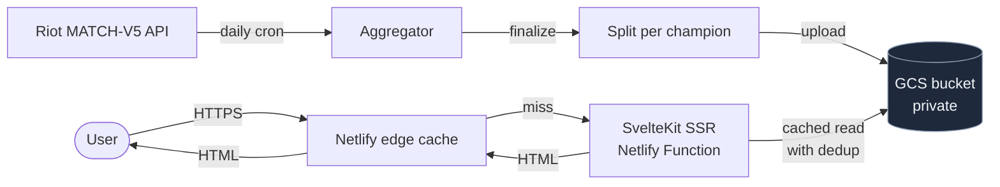

# League Champ Builds

Server-rendered League of Legends champion explorer with build recommendations sampled from Challenger / Grandmaster ranked-solo matches. Always on the latest patch via Riot's [Data Dragon](https://developer.riotgames.com/docs/lol#data-dragon) — no redeploy needed when new champions ship.

**Live:** https://leaguechampbuilds.netlify.app/

[](https://github.com/kloparn/league-champ-builds-app/actions/workflows/test.yml)
[](https://github.com/kloparn/league-champ-builds-app/actions/workflows/refresh-builds.yml)


---

## Architecture

Three independent layers, decoupled by a private GCS bucket so a refresh never triggers a redeploy.



**Data pipeline (offline, daily):**

1. GitHub Actions cron fires the refresh script.
2. Script pulls high-elo leaderboards, then recent ranked-solo matches per summoner via MATCH-V5.
3. Each match's items, runes, summoners, skill order, and item-purchase order are folded into per-champion buckets.
4. Aggregation state is incremental and persisted between runs — see *Incremental state* below.
5. After aggregation, the result is split per champion and uploaded to a private GCS bucket.

**Read path (online, every request):**

1. Browser requests a page.
2. Netlify edge cache serves it from CDN if fresh.
3. On miss, the SvelteKit function loader reads from GCS via service-account credentials.
4. A function-level cache with in-flight deduplication absorbs concurrent miss bursts so a stampede collapses to a single read.
5. Page is rendered server-side and returned.

The bucket is **private** — clients never read it directly. All access goes through the SvelteKit server using a service account.

### Incremental state

Per-patch state lives in `data/`: a compact snapshot of accumulated counts plus an index of already-processed match IDs. Both reset automatically when a new patch is detected, and the per-run match volume is capped so a single refresh stays under the CI timeout while chipping away at any backlog.

---

## Stack

- **SvelteKit 2** + **Svelte 5 (runes)** with TypeScript
- **SSR** via `@sveltejs/adapter-netlify` (Netlify Functions)
- **Tailwind CSS** with a custom hextech-inspired theme
- **`@google-cloud/storage`** for GCS reads (runtime) and writes (refresh script)
- **Vitest** for unit/component tests, **Playwright** for end-to-end
- **Node 22 LTS** (see `.nvmrc`)

## Develop

```bash
nvm use            # Node 22
npm install
npm run dev        # http://localhost:3000
```

A `.env` file at the repo root is loaded automatically by the refresh scripts:

```env
RIOT_API_KEY=<from https://developer.riotgames.com>
GCP_SA_KEY=<base64-encoded service account JSON>
GCS_BUCKET=<your-bucket-name>
```

For local SvelteKit dev against the bucket, the same `GCP_SA_KEY` and `GCS_BUCKET` need to be set in the shell or a SvelteKit-loaded env file.

## Scripts

| Script | What it does |
| --- | --- |
| `npm run dev` | Vite dev server |
| `npm run build` | Production build (Netlify adapter) |
| `npm run preview` | Preview the production build locally |
| `npm run check` | `svelte-check` type-check |
| `npm run test:unit` | Vitest |
| `npm run test:e2e` | Playwright (builds + previews automatically) |
| `npm run test` | Unit + e2e |
| `npm run refresh:builds` | Run a default-mode refresh locally |
| `npm run refresh:builds:fast` | Fast refresh (small sample, ~10–15 min) — useful for testing GCS upload |
| `npm run refresh:builds:github` | Heavy refresh used by the CI cron |

## Deployment

Netlify picks up `netlify.toml` automatically. `npm run build` produces a Netlify Functions–ready bundle in `build/`. The runtime requires:

| Env var | Purpose |
| --- | --- |
| `GCP_SA_KEY` | Read-scoped service account JSON, base64-encoded |
| `GCS_BUCKET` | Bucket name |
| `PUBLIC_SITE_URL` *(optional)* | Override canonical / sitemap URL when deploying to a custom domain |
| `PUBLIC_GOOGLE_SITE_VERIFICATION` *(optional)* | Google Search Console verification token |

## CI

| Workflow | Trigger | What it does |
| --- | --- | --- |
| `.github/workflows/test.yml` | push, PR | type-check → unit tests → build → Playwright |
| `.github/workflows/refresh-builds.yml` | daily cron + manual dispatch | Aggregate latest matches, upload split JSON to GCS, commit only the incremental state files |

The refresh workflow needs `RIOT_API_KEY`, `GCP_SA_KEY`, and `GCS_BUCKET` in repo secrets. The CI service account should have `roles/storage.objectAdmin`; the Netlify runtime account only needs `roles/storage.objectViewer`.

## SEO

- `<title>`, meta description, OG tags, and Twitter cards per route via `<svelte:head>`.
- Canonical URL on every page, driven by `SITE_URL` and the current pathname.
- `/sitemap.xml` lists `/`, `/winrates`, and every champion URL with `<lastmod>` driven by the latest aggregation timestamp.
- `/robots.txt` advertises the sitemap with an absolute URL plus `Host:` directive.
- JSON-LD structured data: `WebSite` on the home page, `BreadcrumbList` + `Article` on champion pages.
- Optional Google Search Console verification meta tag via `PUBLIC_GOOGLE_SITE_VERIFICATION`.
- All pages are server-rendered, so crawlers see real content rather than an empty `#root`.

## License

Riot Games is not affiliated with this project. League of Legends and all related assets © Riot Games, Inc.
